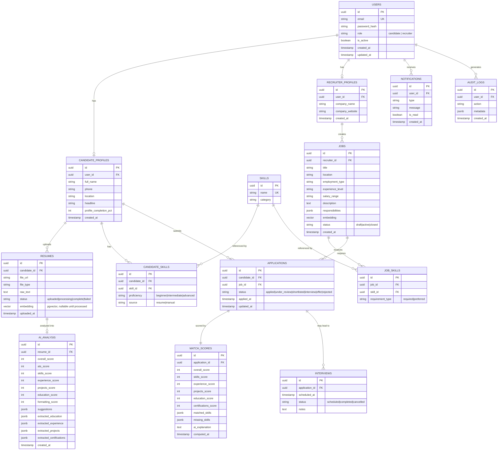

# HireSense AI — System Architecture & Development Plan

> **Reality check, read this first:** The full spec below is genuinely a
> multi-engineer, multi-month SaaS build. You have ~8 weeks solo. I'm giving
> you the *complete* architecture as asked — but every item in the Phases
> section (§7) is tagged **[MVP]** or **[STRETCH]**. Build every MVP item in
> order; treat STRETCH items as bonus if you have time left. If you build
> only the MVP path, you will still have a genuinely impressive, fully
> working, end-to-end AI product for your demo and interviews — with a
> defensible reason for every cut you made (which is itself a good interview
> answer: "I scoped this for an 8-week solo build by cutting X, Y, Z and
> here's why").

---

## 1. High-Level System Architecture

```
┌─────────────────────────────────────────────────────────────────────┐
│                            CLIENT (Browser)                         │
│                    React + TypeScript + Tailwind                    │
│         Candidate Dashboard  │  Recruiter Dashboard  │  Landing     │
└───────────────────────────────┬───────────────────────────────────┘
                                 │ HTTPS / REST (JSON)
┌───────────────────────────────▼───────────────────────────────────┐
│                        FASTAPI BACKEND (API layer)                  │
│  ┌───────────┐ ┌───────────┐ ┌────────────┐ ┌─────────────────┐   │
│  │   Auth     │ │  Candidate │ │  Recruiter │ │   Matching /     │  │
│  │  (JWT/RBAC)│ │   Router   │ │   Router   │ │  Analytics APIs  │  │
│  └───────────┘ └───────────┘ └────────────┘ └─────────────────┘   │
└──────┬───────────────────┬──────────────────────┬─────────────────┘
       │                   │                       │
       │            ┌──────▼──────┐         ┌──────▼──────┐
       │            │   Celery     │         │   Redis      │
       │            │  Task Queue  │◄───────►│ (cache/queue │
       │            │  (async jobs)│         │  /sessions)  │
       │            └──────┬──────┘         └─────────────┘
       │                   │
       │            ┌──────▼─────────────────────────┐
       │            │   AI Processing Workers          │
       │            │  - Resume parsing (PyMuPDF)      │
       │            │  - Info extraction (LLM)         │
       │            │  - Embedding generation           │
       │            │  - Job description analysis (LLM)│
       │            │  - Match scoring                  │
       │            └──────┬─────────────────────────┘
       │                   │
┌──────▼───────────────────▼─────────────────────────────────────────┐
│                          PostgreSQL (+ pgvector)                    │
│   Relational data (users, jobs, applications, scores)               │
│   + vector embeddings for semantic search, in the SAME database     │
└───────────────────────────────────────────────────────────────────┘
```

**Why this shape, in plain terms (good interview answers):**

- **FastAPI stays synchronous/fast for reads** (fetch a job, list applicants)
  and **hands off anything expensive to Celery** (parsing a PDF, calling an
  LLM, generating embeddings). This means a recruiter loading their
  dashboard never waits on an AI call — the API responds in milliseconds
  from the database, while the AI work happens in the background and
  updates the record when done.
- **pgvector instead of a separate vector DB (Pinecone/Weaviate):** for a
  project at your scale (tens of thousands of resumes, not tens of
  millions), Postgres with the `pgvector` extension gives you vector
  similarity search *in the same database* as your relational data — no
  second system to run, sync, or explain in a viva. This is also a more
  defensible interview answer than "I used Pinecone because a tutorial
  did" — you can explain the tradeoff (pgvector: simpler ops, fine to ~1M
  vectors; Pinecone/Weaviate: better at massive scale, managed
  infrastructure, extra cost/complexity).
- **Redis does three jobs**, which is worth being able to explain crisply:
  1. **Celery broker** — the queue that holds pending background tasks.
  2. **Cache** — e.g., a recruiter's analytics dashboard numbers, so you
     don't recompute aggregate queries on every page load.
  3. **Rate limiting** — counting requests per user/IP in a fast in-memory
     store instead of hitting Postgres for every check.

---

## 2. Folder Structure

```
hiresense-ai/
├── frontend/
│   ├── src/
│   │   ├── pages/
│   │   │   ├── landing/
│   │   │   ├── auth/                  # Login, Register, ForgotPassword
│   │   │   ├── candidate/
│   │   │   │   ├── Dashboard.tsx
│   │   │   │   ├── MyResume.tsx
│   │   │   │   ├── ResumeAnalysis.tsx
│   │   │   │   ├── JobRecommendations.tsx
│   │   │   │   ├── JobMatchDetails.tsx
│   │   │   │   ├── SkillGaps.tsx
│   │   │   │   └── Applications.tsx
│   │   │   └── recruiter/
│   │   │       ├── Dashboard.tsx
│   │   │       ├── CreateJob.tsx
│   │   │       ├── JobDetails.tsx
│   │   │       ├── CandidateScreening.tsx
│   │   │       ├── CandidateProfile.tsx
│   │   │       └── Analytics.tsx
│   │   ├── components/
│   │   │   ├── ui/                    # Button, Card, Badge, ProgressBar...
│   │   │   ├── layout/                # Navbar, Sidebar, PageShell
│   │   │   └── charts/
│   │   ├── hooks/                     # useAuth, useJobs, useApplications...
│   │   ├── api/                       # typed API client functions
│   │   ├── types/                     # shared TS types (mirrors backend schemas)
│   │   ├── context/                   # AuthContext
│   │   └── App.tsx
│   ├── package.json
│   └── tailwind.config.ts
│
├── backend/
│   ├── app/
│   │   ├── main.py                    # FastAPI app entrypoint
│   │   ├── core/
│   │   │   ├── config.py              # env/settings
│   │   │   ├── security.py            # JWT, password hashing
│   │   │   └── deps.py                # shared dependencies (get_current_user)
│   │   ├── models/                    # SQLAlchemy ORM models
│   │   ├── schemas/                   # Pydantic request/response schemas
│   │   ├── routers/
│   │   │   ├── auth.py
│   │   │   ├── candidates.py
│   │   │   ├── recruiters.py
│   │   │   ├── resumes.py
│   │   │   ├── jobs.py
│   │   │   ├── applications.py
│   │   │   ├── matching.py
│   │   │   └── analytics.py
│   │   ├── services/                  # business logic, called by routers
│   │   │   ├── resume_service.py
│   │   │   ├── job_service.py
│   │   │   ├── matching_service.py
│   │   │   └── analytics_service.py
│   │   └── db/
│   │       ├── session.py
│   │       └── base.py
│   ├── alembic/                       # DB migrations
│   ├── requirements.txt
│   └── Dockerfile
│
├── ai/
│   ├── extraction/
│   │   ├── resume_parser.py           # PDF/DOCX -> raw text
│   │   └── info_extractor.py          # LLM prompt -> structured JSON
│   ├── embeddings/
│   │   └── embedder.py                # text -> vector
│   ├── matching/
│   │   ├── scorer.py                  # weighted scoring logic
│   │   └── explainer.py               # LLM-generated match explanation
│   └── prompts/                       # versioned prompt templates
│
├── workers/
│   ├── celery_app.py
│   └── tasks/
│       ├── resume_tasks.py
│       ├── job_tasks.py
│       └── matching_tasks.py
│
├── tests/
│   ├── backend/
│   └── ai/
│
├── docker/
│   ├── docker-compose.yml
│   ├── backend.Dockerfile
│   └── frontend.Dockerfile
│
├── docs/
│   └── ARCHITECTURE.md                # this file
│
└── .env.example
```

---

## 3. Database Schema (ERD)



**Design notes worth remembering for your viva:**
- `embedding` columns use `pgvector`'s `vector` type — a resume and a job
  each get one embedding vector (of their combined text), used for the
  semantic-similarity portion of the match score (an IVFFlat or HNSW index
  on these columns is what makes similarity search fast at scale).
- `match_scores` is a separate table from `applications` (not columns on
  it) because scores can be **recomputed** (e.g., candidate updates resume,
  or you retune scoring weights) without touching the application record
  itself — keeps history/audit trail clean.
- `ai_analysis` stores extracted structured fields as `jsonb` rather than
  rigid columns, because resume structure varies a lot (not everyone has
  the same project/certification fields) — `jsonb` gives you flexibility
  while still being queryable in Postgres.

---

## 4. API Architecture

All endpoints prefixed `/api/v1`. Auth via `Authorization: Bearer <JWT>`.
RBAC enforced via a `require_role("candidate"|"recruiter")` FastAPI dependency.

### Auth
| Method | Endpoint | Description |
|---|---|---|
| POST | `/auth/register` | Create account, role = candidate\|recruiter |
| POST | `/auth/login` | Returns access + refresh JWT |
| POST | `/auth/refresh` | Exchange refresh token for new access token |
| POST | `/auth/forgot-password` | Sends reset link (email, or logged token in dev) |
| POST | `/auth/reset-password` | Sets new password via reset token |
| GET  | `/auth/me` | Current user info |

### Candidate
| Method | Endpoint | Description |
|---|---|---|
| GET/PUT | `/candidates/me` | View/edit own profile |
| POST | `/resumes/upload` | Upload resume file → enqueues Celery parse job |
| GET | `/resumes/{id}` | Resume status + extracted data once processed |
| GET | `/resumes/{id}/analysis` | AI resume score + suggestions |
| GET | `/candidates/me/recommendations` | Top matching jobs (vector search + scoring) |
| GET | `/candidates/me/skill-gaps` | Missing skills aggregated across top matches |
| POST | `/applications` | Apply to a job |
| GET | `/applications` | List own applications + statuses |

### Recruiter
| Method | Endpoint | Description |
|---|---|---|
| GET/PUT | `/recruiters/me` | Company profile |
| POST | `/jobs` | Create job (draft) |
| POST | `/jobs/{id}/analyze` | AI-extract skills/experience/education from JD → enqueues Celery |
| GET | `/jobs` | List recruiter's jobs |
| GET | `/jobs/{id}` | Job details + applicant count + avg match |
| GET | `/jobs/{id}/candidates` | Ranked applicant list with filters/sort |
| GET | `/candidates/{id}` | Candidate profile (recruiter view) |
| GET | `/matches/{candidate_id}/{job_id}` | Full match breakdown + AI explanation |
| PATCH | `/applications/{id}/status` | Shortlist / reject / move stage |
| GET | `/analytics/recruiter` | Dashboard aggregate metrics |

### Shared
| Method | Endpoint | Description |
|---|---|---|
| GET | `/notifications` | User's notifications |
| GET | `/skills?query=` | Skill autocomplete |

---

## 5. Frontend Pages

**Public:** Landing, How It Works, Login, Register, Forgot/Reset Password

**Candidate:** Dashboard · My Profile · My Resume (upload + status) · Resume
Analysis · Job Recommendations · Job Match Details · Skill Gaps ·
Applications (pipeline view) · Settings

**Recruiter:** Dashboard · Jobs (list) · Create/Edit Job · Job Details ·
Candidate Screening (filter/sort/rank table) · Candidate Profile (AI match
breakdown) · Analytics · Settings

---

## 6. Core User Flows

**Candidate:** Register → Upload Resume → (Celery: parse → extract → embed)
→ Resume Score shown → Skills extracted → Job Recommendations (vector
search top-N + weighted rescore) → Open a job → Match % + matched/missing
skills + AI explanation → Apply → Track status through pipeline.

**Recruiter:** Login → Create Job → "Analyze with AI" (Celery: extract
required/preferred skills, experience, education from JD text) → Applicants
arrive → Screening table auto-ranked by match score → Open candidate → Full
match breakdown + AI summary → Shortlist / Reject / Move to Interview.

---

## 7. Development Phases — prioritized for an 8-week solo build

Legend: **[MVP]** = build this, it's load-bearing for the demo.
**[STRETCH]** = only if MVP is done early.

### Weeks 1-2 — Foundation
- **[MVP]** Repo scaffold: backend (FastAPI+SQLAlchemy+Alembic), frontend
  (Vite+React+TS+Tailwind), Docker Compose (Postgres+Redis+backend+frontend).
- **[MVP]** DB schema + migrations for core tables (`users`,
  `candidate_profiles`, `recruiter_profiles`, `skills`, `jobs`, `job_skills`,
  `applications`).
- **[MVP]** Auth: register/login, JWT, role-based route protection (both
  frontend and backend).
- **[STRETCH]** Forgot/reset password flow (nice to have; not demo-critical
  — you can show "Login" working and mention this exists).

### Weeks 3-4 — Resume Pipeline (the core AI feature)
- **[MVP]** Resume upload (PDF/DOCX) → text extraction (PyMuPDF/pdfplumber
  + python-docx).
- **[MVP]** LLM-based structured extraction (name, skills, education,
  experience, projects) — one well-tested prompt, not a chain of five.
- **[MVP]** Store extracted data + generate one embedding per resume.
- **[MVP]** Resume Analysis page (score + category breakdown + suggestions)
  — the scores can be a straightforward weighted formula over extracted
  fields; you don't need a separately trained scoring model.
- **[STRETCH]** Async status polling UI (upload → processing → complete)
  with nice loading states — do a simple version (spinner + poll every 2s)
  rather than WebSockets.

### Weeks 5-6 — Job Pipeline + Matching Engine
- **[MVP]** Job creation form + "Analyze with AI" (same extraction pattern
  as resumes, applied to job descriptions).
- **[MVP]** Matching engine: cosine similarity on embeddings (pgvector) +
  weighted skill/experience/education overlap → single overall score. Keep
  weights as named constants in one config file, not hardcoded — that's
  what "configurable weights" means in practice at this scale, you don't
  need an admin UI for it.
- **[MVP]** Match explanation: one LLM call that takes the score breakdown
  + matched/missing skills and returns 2-3 sentences of plain-English
  explanation. Cache this per (resume, job) pair so you're not re-calling
  the LLM every page view.
- **[MVP]** Job Recommendations (candidate side) + Candidate Screening
  table (recruiter side) — both are really "run matching, sort by score,
  render a list," sharing most of the same backend logic.
- **[STRETCH]** Configurable weights via an actual settings UI. Skip it —
  a config constant is a fine, honest answer in interviews.

### Week 7 — Dashboards, Applications, Polish
- **[MVP]** Application flow: apply → status pipeline (Applied → Review →
  Shortlisted → Interview) with recruiter actions to move candidates
  through it.
- **[MVP]** Candidate + Recruiter dashboard KPI cards (resume score, jobs
  matched, active jobs, applicant counts — simple aggregate queries, cache
  in Redis with a short TTL).
- **[MVP]** Seed script: 10 candidates, 5 recruiters, 10 jobs, ~50
  applications with varied match scores, so the demo looks alive.
- **[STRETCH]** Recruiter Analytics charts (hiring funnel, skill
  distribution). If you cut this, you still have the KPI cards, which
  cover "shows data-oriented thinking" in a demo.

### Week 8 — Testing, Docker, Deployment, Docs
- **[MVP]** Docker Compose brings up the whole stack with one command —
  this alone is a strong interview signal.
- **[MVP]** A handful of meaningful tests: auth flow, resume upload →
  parse, matching score calculation. Not full coverage — a demonstrable
  testing *approach*.
- **[MVP]** README with architecture diagram, setup instructions, and a
  "why these technologies" section (you can lift this straight from §1
  above) — this is what you'll actually show/talk through in interviews.
- **[STRETCH]** GitHub Actions CI (lint + test on push). Good if there's
  time; not what makes or breaks your demo.

### What's cut from the original spec entirely (and why that's fine)
- **Celery for everything** → keep Celery only for resume/job AI
  processing (the genuinely slow steps). Don't build a queue for things
  that are fast enough to do inline (e.g., simple CRUD) — using async
  queues where they're not needed is itself a design smell worth avoiding.
- **Separate vector DB (Pinecone)** → pgvector, see §1.
- **Full RBAC audit logging / notifications system** → a `notifications`
  table exists in the schema for completeness, but a full notification
  center UI is a stretch goal, not core to demonstrating the AI matching
  story.
- **Rate limiting infrastructure** → mention it's a known gap ("Redis-based
  rate limiting is a next step") rather than half-build it.

This cut list is itself useful in interviews — "I identified the
production-grade version would include X, scoped it out for time, and
here's specifically what I'd add first" is a stronger answer than having
built everything shallowly.
